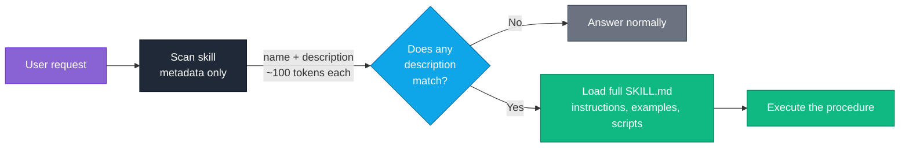

<div align="center">

# ClaudeCode-OneShot

### The curated blueprint for building the ultimate Claude Skills repository

*Skills tell Claude **how** to work. MCP servers decide **what** it can reach. Plugins extend **where** it runs.*
*This repo curates the best of all three — and shows you how to write your own.*

[](https://awesome.re)
[](LICENSE)
[](CONTRIBUTING.md)
[](#-the-skill-index)
[](#-mcp-servers)

[**Quick Start**](#-quick-start) · [**Hall of Fame**](#-hall-of-fame) · [**Skill Index**](#-the-skill-index) · [**MCP Servers**](#-mcp-servers) · [**Write a Skill**](#-anatomy-of-a-skill-that-actually-fires) · [**Contribute**](CONTRIBUTING.md)

</div>

---

## Why this exists in this day n age

Claude's ecosystem has three moving parts that everyone conflates. Skills are markdown files
containing procedural knowledge. MCP servers are processes granting access to the outside world.
Plugins are CLI extensions. Confusing them is the single most common reason people's setups don't
work.

|  | **Skills** | **MCP Servers** | **Plugins** |
|---|---|---|---|
| **Answers** | *How* should Claude do this? | *What* can Claude reach? | *Where* does Claude run? |
| **Format** | `SKILL.md` + frontmatter | A running process (stdio/HTTP) | CLI package |
| **Gives you** | Procedure, standards, taste | Data, APIs, side effects | Commands, hooks, bundled tools |
| **Loads** | On demand, when relevant | At session start | At install time |
| **Example** | "Profile any CSV like this" | "Query this Postgres DB" | "Persist tasks across sessions" |
| **Lives in** | [`skills/`](skills) | [`mcp-servers/`](mcp-servers) | [`claude-code-plugins/`](claude-code-plugins) |

> [!TIP]
> If you're deciding which one you need: reach for a **skill** when Claude *can* already do the task
> but does it inconsistently. Reach for an **MCP server** when Claude simply cannot see the thing
> you're talking about.

---

## 🚀 Quick Start

Skills are just folders. Drop one in the right place and Claude finds it.

```bash
# Personal — available in every project
mkdir -p ~/.claude/skills/my-skill && cp templates/SKILL_TEMPLATE.md ~/.claude/skills/my-skill/SKILL.md

# Project — committed to the repo, shared with your team
mkdir -p .claude/skills/my-skill && cp templates/SKILL_TEMPLATE.md .claude/skills/my-skill/SKILL.md
```

Then edit the frontmatter. That's the whole install step — no build, no registry, no restart.

<details>
<summary><b>Adding an MCP server instead</b></summary>

MCP servers need a config entry so Claude knows how to launch them:

```json
{
  "mcpServers": {
    "postgres": {
      "command": "npx",
      "args": ["-y", "@modelcontextprotocol/server-postgres", "${DATABASE_URL}"]
    }
  }
}
```

Keep credentials in environment variables and reference them with `${VAR}` — never paste a live
connection string into a file you intend to commit.

</details>

---

## 🧠 How Skills Actually Work

The Skills use **progressive disclosure**. Claude does not read your whole skill library on every turn —
it reads only the metadata, then pulls the full instruction set for the one skill that matches.



**The consequence, and it is the whole ballgame:** the `description` field is the only part of your
skill Claude sees when deciding whether to use it. A brilliant skill with a vague description is a
skill that never runs.

---

## 🏆 Hall of Fame

The mega-repositories driving the Claude ecosystem. Start here.

| Repository | Why it matters |
|---|---|
| **[anthropics/skills](https://github.com/anthropics/skills)** <br/> `official` | The canonical agent-skills specification, the document-creation skills (`docx`, `pdf`, `pptx`, `xlsx`), and reference templates. When the spec and a blog post disagree, this repo wins. |
| **[ComposioHQ/awesome-claude-skills](https://github.com/ComposioHQ/awesome-claude-skills)** <br/> `1000+ skills` | Vast directory of practical skills and plugins, with auth and connections to 1,000+ apps handled through the Composio gateway. |
| **[GetBindu/awesome-claude-code-and-skills](https://github.com/GetBindu/awesome-claude-code-and-skills)** <br/> `personas` | 67 MIT-licensed skills, 368 persona-based skills (`startup-cto` and friends), 76 expert agents, 859 Python tools. |
| **[travisvn/awesome-claude-skills](https://github.com/travisvn/awesome-claude-skills)** <br/> `community` | Heavily starred list with genuinely good writing on progressive-disclosure architecture, UI workflows, and how to vet a skill before trusting it. |
| **[ai-for-developers/awesome-claude](https://github.com/ai-for-developers/awesome-claude)** <br/> `frameworks` | SDKs, agent frameworks (LangGraph, CrewAI), and prompt architectures. Zoom out from skills to whole-system design. |
| **[win4r/Awesome-Claude-MCP-Servers](https://github.com/win4r/Awesome-Claude-MCP-Servers)** <br/> `MCP` | The premier curated MCP list, filtered specifically for Claude compatibility. |

---

## 📚 The Skill Index

### 💻 Development & Code

| Skill | What it does | Reach for it when |
|---|---|---|
| **web-artifacts-builder** | Builds complex web apps for the claude.ai interface using React, Tailwind, and shadcn/ui | You want an artifact that looks designed, not defaulted |
| **root-cause-tracing** | Traces backward from a deep stack error to the original trigger | The exception fires four layers below the actual bug |
| **ios-simulator-skill** | Drives the iOS Simulator, preferring accessibility APIs over screenshots | You need real device interaction, not a static render |
| **test-fixing** | Detects failing tests and proposes patches | The suite is red and you want a diagnosis, not a rerun |

> [!NOTE]
> **root-cause-tracing** is the sleeper hit of this category. Most debugging failures aren't reasoning
> failures — they're the model patching the first symptom it sees. A skill that mandates tracing
> backward changes the outcome more than a smarter model does.

### 📊 Research & Data Analysis

| Skill | What it does | Reach for it when |
|---|---|---|
| **recursive-research** | Autonomous multi-hop research with source tiering, Munger inversion for decisions, and disk checkpointing that survives context compaction | The question needs 40 sources, not 4 |
| **[csv-data-summarizer](skills/data-and-analysis/csv-data-summarizer)** ✅ | Profiles a CSV for dtypes, distributions, null density, and correlations — unprompted | Someone hands you a file and says "what's in this?" |

✅ = full implementation included in this repo, ready to copy.

### 💬 Communication & Branding

| Skill | What it does | Reach for it when |
|---|---|---|
| **brand-guidelines** | Applies official brand colors, fonts, and typography to artifacts | Every deck and artifact should look like it came from one company |
| **internal-comms** | Drafts newsletters, status reports, and FAQs in house format | You write the same update every week in a slightly different voice |

### 🔒 Security & QA

Open for contributions — threat modeling, dependency auditing, and test-strategy skills all belong
here. See [CONTRIBUTING.md](CONTRIBUTING.md).

---

## 🔌 MCP Servers

| Server | Capability | Notes |
|---|---|---|
| [`server-postgres`](https://github.com/modelcontextprotocol/servers) | Read-only SQL + schema inspection | Read-only by design — a safe default for pointing an agent at production |
| [`server-memory`](https://github.com/modelcontextprotocol/servers) | Knowledge-graph persistent memory | State that survives across sessions |
| [`server-github`](https://github.com/modelcontextprotocol/servers) | Repos, issues, PRs via the GitHub API | Official integration |
| [`exa-mcp-server`](https://github.com/exa-labs/exa-mcp-server) | Real-time web search | Exa AI Search API; needs `EXA_API_KEY` |

> [!WARNING]
> An MCP server runs with whatever credentials you hand it. Scope the database user, prefer
> read-only, and keep keys in the environment — not in a committed config file.

Config examples: [`mcp-servers/databases`](mcp-servers/databases) · [`mcp-servers/tools-and-utils`](mcp-servers/tools-and-utils)

---

## 🧩 Claude Code Plugins

| Plugin | What it adds |
|---|---|
| **backlog** | Persistent cross-session task management in pure TypeScript, exposing 24 MCP tools for dependencies and docs |
| **AgentLint** | 33 evidence-backed checks scoring how agent-ready your repository is |
| **mcp-builder** | Guided workflow for building high-quality MCP servers around external APIs |

---

## ✍️ Anatomy of a Skill That Actually Fires

Every skill needs valid YAML frontmatter to work in both the Claude web interface and the Claude
Code CLI:

```markdown
---
name: your-skill-name
description: What it does, and exactly when Claude should invoke it. Max 200 characters.
dependencies: python>=3.8, pandas>=1.5.0
---

# Detailed Instructions
```

### The description is the trigger

| | Description | Outcome |
|---|---|---|
| ❌ | `A powerful skill for working with data.` | Never fires. Matches everything, so it means nothing. |
| ❌ | `Data analysis helper.` | Never fires. States a category, not a condition. |
| ✅ | `Profiles a CSV for column types, distributions, missing data, and correlations. Use when a user shares a tabular file or asks for a data profile.` | Fires reliably. Names the trigger *and* the artifact. |

The pattern: **what it does** + **when to invoke it**. Both halves, under 200 characters.

### Structure of the body

| Section | Purpose | Skippable? |
|---|---|---|
| `# Detailed Instructions` | Declarative rules, imperative voice | No |
| `## Overview` | The goal and the knowledge enclosed | No |
| `## Workflow Rules` | Numbered, ordered steps | No |
| `## Anti-Patterns` | What Claude must *not* do | **No — this is the load-bearing one** |
| `## Examples` | Few-shot: a request and the exact expected output | No |

> [!IMPORTANT]
> Skills without an **Anti-Patterns** section fail in the field more often than skills with weak
> instructions. Stating what not to do removes the failure modes that positive instructions alone
> never quite eliminate.

Start from [`templates/SKILL_TEMPLATE.md`](templates/SKILL_TEMPLATE.md), and read
[`csv-data-summarizer`](skills/data-and-analysis/csv-data-summarizer/SKILL.md) as a worked example.

---

## 🗂 Repository Layout

Procedural knowledge, external access, and terminal tooling stay strictly separated.

```text
ClaudeCode-OneShot/
├── README.md
├── CONTRIBUTING.md              # submission rules + review bar
├── CODE_OF_CONDUCT.md
├── skills/                      # procedural knowledge
│   ├── development/
│   ├── data-and-analysis/       # ← csv-data-summarizer lives here
│   ├── business-and-comms/
│   └── security-and-qa/
├── mcp-servers/                 # external access
│   ├── databases/
│   └── tools-and-utils/
├── claude-code-plugins/         # CLI extensions
└── templates/
    └── SKILL_TEMPLATE.md        # start every skill here
```

---

## 🤝 Contributing

Two kinds of PR: **a link** for the curated lists, or **a skill** that lives in this repo.

Every submission is vetted against the template, and the `description` field gets the most scrutiny —
it decides whether the skill is ever used. Read [CONTRIBUTING.md](CONTRIBUTING.md) for the full
checklist. By participating you agree to the [Code of Conduct](CODE_OF_CONDUCT.md).

<details>
<summary><b>The 60-second version of the review bar</b></summary>

- `name` is kebab-case and matches the folder name
- `description` is under 200 characters and names its trigger condition
- Frontmatter parses as valid YAML
- Every template section is filled in — an empty `## Examples` is an automatic request for changes
- You have run the skill at least once in Claude Code or the web interface

</details>

---

<div align="center">

**[⬆ Back to top](#claudecode-oneshot)**

Released under [CC0 1.0](LICENSE) — public domain. Linked projects keep their own licenses.

</div>
